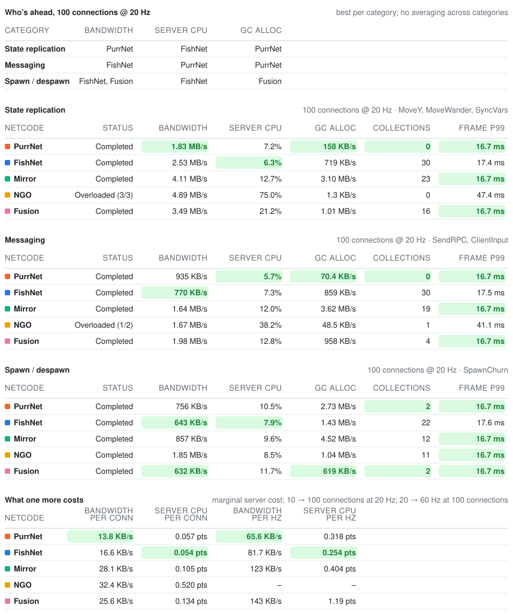

_Last run 2026-09-04: PurrNet 1.23.0-beta.27 · FishNet 4.7.3 · Mirror 96.0.1 · NGO 2.13.2 · Fusion 2.1.2 Stable 2279 · Unity 6000.5.4f1 · 100 objects per test · 10 s windows · sessions 10c @ 20 Hz / 100c @ 20 Hz / 100c @ 60 Hz._

<picture>
  <source media="(prefers-color-scheme: dark)" srcset="latest-dark.svg">
  
</picture>

Same tables as text

**State replication** (100 connections @ 20 Hz · MoveY, MoveWander, SyncVars)

| Netcode | Status | Bandwidth | Server CPU | GC alloc | Collections | Frame p99 |
|---|---:|---:|---:|---:|---:|---:|
| PurrNet | complete | **1.79 MB/s** | 7.4% | **589 KB/s** | 1 | **16.7 ms** |
| FishNet | complete | 2.52 MB/s | **6.3%** | 738 KB/s | 27 | 17.4 ms |
| Mirror | complete | 4.12 MB/s | 12.6% | 3.13 MB/s | 23 | **16.7 ms** |
| NGO | stalled 3/3 | – | – | – | **0** | 47.6 ms |
| Fusion | complete | 3.50 MB/s | 21.5% | 1.01 MB/s | 16 | **16.7 ms** |

**Messaging** (100 connections @ 20 Hz · SendRPC, ClientInput)

| Netcode | Status | Bandwidth | Server CPU | GC alloc | Collections | Frame p99 |
|---|---:|---:|---:|---:|---:|---:|
| PurrNet | complete | 935 KB/s | **5.9%** | **671 KB/s** | **1** | **16.7 ms** |
| FishNet | complete | **770 KB/s** | 7.3% | 848 KB/s | 28 | 17.6 ms |
| Mirror | complete | 1.63 MB/s | 11.8% | 3.67 MB/s | 18 | **16.7 ms** |
| NGO | stalled 1/2 | – | – | – | **1** | 40.9 ms |
| Fusion | complete | 1.98 MB/s | 12.8% | 929 KB/s | 4 | **16.7 ms** |

**Spawn / despawn** (100 connections @ 20 Hz · SpawnChurn)

| Netcode | Status | Bandwidth | Server CPU | GC alloc | Collections | Frame p99 |
|---|---:|---:|---:|---:|---:|---:|
| PurrNet | complete | 775 KB/s | 14.0% | 3.18 MB/s | 3 | **16.7 ms** |
| FishNet | complete | 640 KB/s | **7.8%** | 1.49 MB/s | 22 | 17.6 ms |
| Mirror | complete | 856 KB/s | 9.4% | 4.60 MB/s | 12 | **16.7 ms** |
| NGO | complete | 2.10 MB/s | 11.2% | 1.03 MB/s | 10 | **16.7 ms** |
| Fusion | complete | **625 KB/s** | 11.6% | **424 KB/s** | **2** | **16.7 ms** |

**What one more costs** (marginal server cost; 10 → 100 connections at 20 Hz; 20 → 60 Hz at 100 connections)

| Netcode | Bandwidth per conn | Server CPU per conn | Bandwidth per Hz | Server CPU per Hz |
|---|---:|---:|---:|---:|
| PurrNet | **13.6 KB/s** | 0.064 pts | **65.8 KB/s** | 0.348 pts |
| FishNet | 16.6 KB/s | **0.053 pts** | 81.8 KB/s | **0.257 pts** |
| Mirror | 28.1 KB/s | 0.103 pts | 125 KB/s | 0.413 pts |
| NGO | – | – | – | – |
| Fusion | 25.7 KB/s | 0.135 pts | – | – |

Categories are reported separately, with no combined ranking. Bandwidth, CPU and allocation: averages; collections: total; frame p99: maximum. Incomplete or stalled categories have no averages. Idle and Static remain baselines; scaling requires the full suite.
Full results: [interactive report](https://purrnet.github.io/unity-netcode-benchmark/) · [workflow run](https://github.com/PurrNet/unity-netcode-benchmark/actions/runs/33924304494) · [raw datapoints](latest.json).
