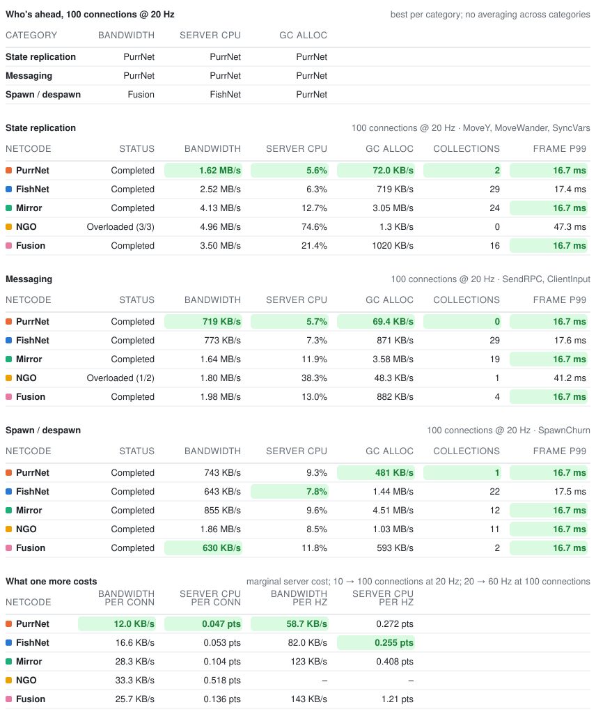

_Last run 2026-09-28: PurrNet 1.24.0-beta.21 · FishNet 4.7.3 · Mirror 96.0.1 · NGO 2.13.2 · Fusion 2.1.2 Stable 2279 · Unity 6000.5.4f1 · 100 objects per test · 10 s windows · sessions 10c @ 20 Hz / 100c @ 20 Hz / 100c @ 60 Hz._

_Note: NGO at 100c @ 60 Hz: resource limit exceeded (8 GiB memory)._

<picture>
  <source media="(prefers-color-scheme: dark)" srcset="latest-dark.svg">
  
</picture>

Same tables as text

**Who's ahead, 100 connections @ 20 Hz** (best per category; no averaging across categories)

| Category | Bandwidth | Server CPU | GC alloc |
|---|---:|---:|---:|
| State replication | PurrNet | PurrNet | PurrNet |
| Messaging | PurrNet | PurrNet | PurrNet |
| Spawn / despawn | Fusion | FishNet | PurrNet |

**State replication** (100 connections @ 20 Hz · MoveY, MoveWander, SyncVars)

| Netcode | Status | Bandwidth | Server CPU | GC alloc | Collections | Frame p99 |
|---|---:|---:|---:|---:|---:|---:|
| PurrNet | Completed | **1.62 MB/s** | **5.6%** | **72.0 KB/s** | **2** | **16.7 ms** |
| FishNet | Completed | 2.52 MB/s | 6.3% | 719 KB/s | 29 | 17.4 ms |
| Mirror | Completed | 4.13 MB/s | 12.7% | 3.05 MB/s | 24 | **16.7 ms** |
| NGO | Overloaded (3/3) | 4.96 MB/s | 74.6% | 1.3 KB/s | 0 | 47.3 ms |
| Fusion | Completed | 3.50 MB/s | 21.4% | 1020 KB/s | 16 | **16.7 ms** |

**Messaging** (100 connections @ 20 Hz · SendRPC, ClientInput)

| Netcode | Status | Bandwidth | Server CPU | GC alloc | Collections | Frame p99 |
|---|---:|---:|---:|---:|---:|---:|
| PurrNet | Completed | **719 KB/s** | **5.7%** | **69.4 KB/s** | **0** | **16.7 ms** |
| FishNet | Completed | 773 KB/s | 7.3% | 871 KB/s | 29 | 17.6 ms |
| Mirror | Completed | 1.64 MB/s | 11.9% | 3.58 MB/s | 19 | **16.7 ms** |
| NGO | Overloaded (1/2) | 1.80 MB/s | 38.3% | 48.3 KB/s | 1 | 41.2 ms |
| Fusion | Completed | 1.98 MB/s | 13.0% | 882 KB/s | 4 | **16.7 ms** |

**Spawn / despawn** (100 connections @ 20 Hz · SpawnChurn)

| Netcode | Status | Bandwidth | Server CPU | GC alloc | Collections | Frame p99 |
|---|---:|---:|---:|---:|---:|---:|
| PurrNet | Completed | 743 KB/s | 9.3% | **481 KB/s** | **1** | **16.7 ms** |
| FishNet | Completed | 643 KB/s | **7.8%** | 1.44 MB/s | 22 | 17.5 ms |
| Mirror | Completed | 855 KB/s | 9.6% | 4.51 MB/s | 12 | **16.7 ms** |
| NGO | Completed | 1.86 MB/s | 8.5% | 1.03 MB/s | 11 | **16.7 ms** |
| Fusion | Completed | **630 KB/s** | 11.8% | 593 KB/s | 2 | **16.7 ms** |

**What one more costs** (marginal server cost; 10 → 100 connections at 20 Hz; 20 → 60 Hz at 100 connections)

| Netcode | Bandwidth per conn | Server CPU per conn | Bandwidth per Hz | Server CPU per Hz |
|---|---:|---:|---:|---:|
| PurrNet | **12.0 KB/s** | **0.047 pts** | **58.7 KB/s** | 0.272 pts |
| FishNet | 16.6 KB/s | 0.053 pts | 82.0 KB/s | **0.255 pts** |
| Mirror | 28.3 KB/s | 0.104 pts | 123 KB/s | 0.408 pts |
| NGO | 33.3 KB/s | 0.518 pts | – | – |
| Fusion | 25.7 KB/s | 0.136 pts | 143 KB/s | 1.21 pts |

Categories are reported separately, with no combined ranking. Bandwidth, CPU and allocation: averages; collections: total; frame p99: maximum. Categories that did not complete have no averages. Completed means the test finished. Overloaded means it finished but the server could not hold the 60 fps budget in that many tests (frame p99 past 33 ms or a sixth of frames dropped); its numbers are shown but never marked best, since they describe a saturated server. Idle and Static remain baselines; scaling requires the full suite.
Full results: [interactive report](https://purrnet.github.io/unity-netcode-benchmark/) · [workflow run](https://github.com/PurrNet/unity-netcode-benchmark/actions/runs/36489837711) · [raw datapoints](latest.json).
