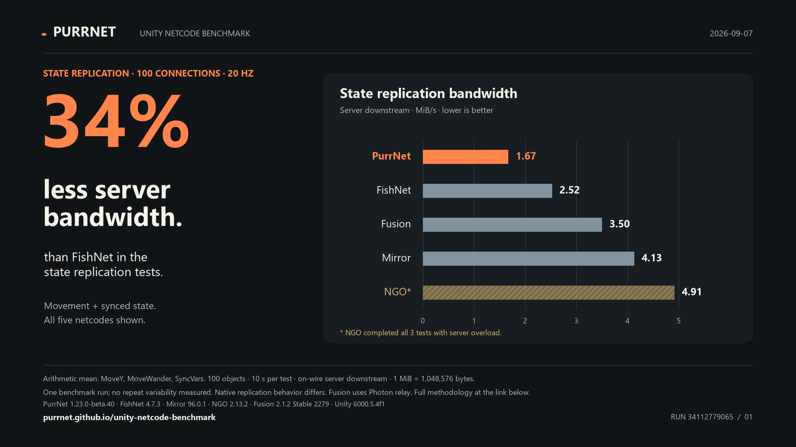
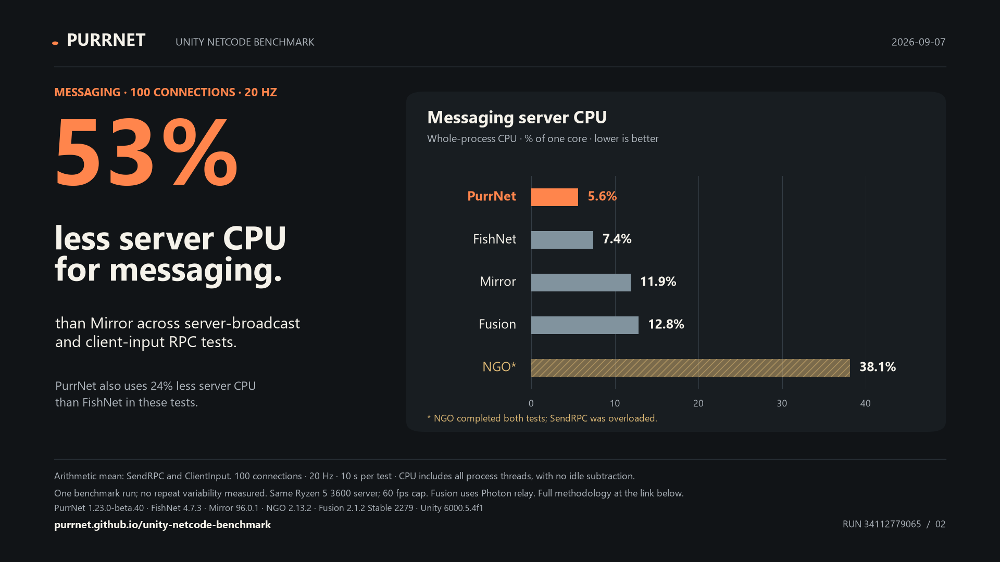
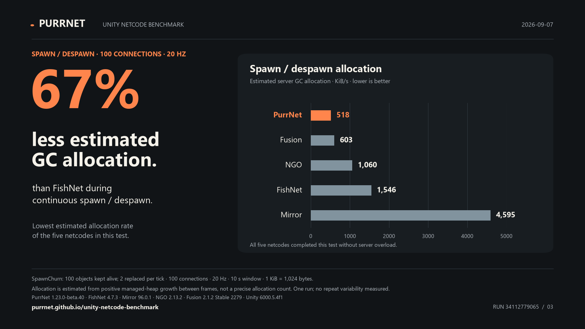
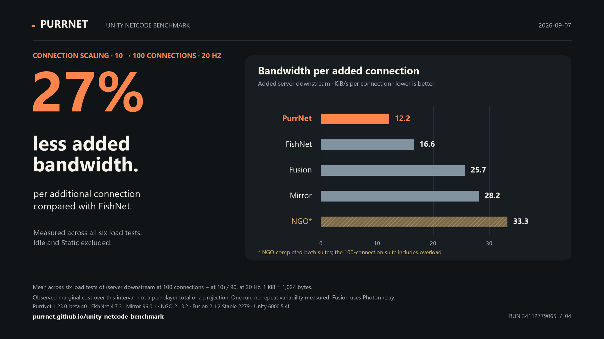

# PurrNet promotional benchmark charts

Four 1920 × 1080 PNG images and matching scalable SVGs, based on the **2026-09-07** published run.

[PurrNet 1.23.0-beta.40 · FishNet 4.7.3 · Mirror 96.0.1 · NGO 2.13.2 · Fusion 2.1.2 Stable 2279](https://github.com/PurrNet/unity-netcode-benchmark/actions/runs/34112779065)

These are selected category advantages, not an overall netcode ranking. All five netcodes are shown on linear scales starting at zero. Overloaded rows remain visible and are marked. Percent reductions use unrounded raw values, rounded to the nearest whole percent.

## State replication bandwidth

PurrNet: 34% less server bandwidth than FishNet in the state replication tests. State replication · 100 connections · 20 Hz.



[PNG](01-state-bandwidth.png) · [SVG](01-state-bandwidth.svg)

Arithmetic mean: MoveY, MoveWander, SyncVars. 100 objects · 10 s per test · on-wire server downstream · 1 MiB = 1,048,576 bytes.

One benchmark run; no repeat variability measured. Native replication behavior differs. Fusion uses Photon relay. Full methodology at the link below.

## Messaging server CPU

PurrNet: 53% less server CPU for messaging than Mirror across server-broadcast and client-input RPC tests. Messaging · 100 connections · 20 Hz.



[PNG](02-messaging-cpu.png) · [SVG](02-messaging-cpu.svg)

Arithmetic mean: SendRPC and ClientInput. 100 connections · 20 Hz · 10 s per test · CPU includes all process threads, with no idle subtraction.

One benchmark run; no repeat variability measured. Same Ryzen 5 3600 server; 60 fps cap. Fusion uses Photon relay. Full methodology at the link below.

## Spawn / despawn allocation

PurrNet: 67% less estimated GC allocation than FishNet during continuous spawn / despawn. Spawn / despawn · 100 connections · 20 Hz.



[PNG](03-spawn-allocation.png) · [SVG](03-spawn-allocation.svg)

SpawnChurn: 100 objects kept alive; 2 replaced per tick · 100 connections · 20 Hz · 10 s window · 1 KiB = 1,024 bytes.

Allocation is estimated from positive managed-heap growth between frames, not a precise allocation count. One run; no repeat variability measured.

## Bandwidth per added connection

PurrNet: 27% less added bandwidth per additional connection compared with FishNet. Connection scaling · 10 → 100 connections · 20 Hz.



[PNG](04-connection-scaling.png) · [SVG](04-connection-scaling.svg)

Mean across six load tests of (server downstream at 100 connections − at 10) / 90, at 20 Hz. 1 KiB = 1,024 bytes.

Observed marginal cost over this interval; not a per-player total or a projection. One run; no repeat variability measured. Fusion uses Photon relay.

## Provenance and calculation

- [Source workflow run](https://github.com/PurrNet/unity-netcode-benchmark/actions/runs/34112779065)
- [Full methodology and live report](https://purrnet.github.io/unity-netcode-benchmark/)
- [Raw source at the pulled revision](https://github.com/PurrNet/unity-netcode-benchmark/blob/b8cdca150744c09822ef40af451b70e1850e40e7/docs/latest.json)
- Source JSON SHA-256: `843a033dbf20510ccf569292a008ba871b785fec663a420dc766bfeca21683c5`
- [Exact plotted values and claims](chart-data.json)
- Reduction formula: `100 × (1 − PurrNet / named competitor)`.
- Category values use the existing report’s arithmetic means and completion/overload rules.
- Scaling averages six per-test deltas: MoveY, MoveWander, SyncVars, SendRPC, ClientInput, SpawnChurn.
- State and messaging NGO rows include overload. This can make resource use lower than equivalent unsaturated service; they are not eligible for best-value claims.
- Allocation is a positive heap-growth estimate, not the profiler allocation counter or process memory usage.
- Individual versions, transport differences, replication behavior, and benchmark overrides are documented in the full methodology.

## Regenerate

Install `matplotlib` and `pillow`, then run from the repository root:

```sh
python .github/scripts/render-promo.py
```

This reads `docs/latest.json` and the run metadata in `docs/latest.md`, and writes a dated folder under `docs/promo/`. To reproduce an older run, pass its matching `--data` and `--summary` files, plus `--source-revision` and `--output`. The renderer stops when required data are missing or the highlighted result is overloaded.
