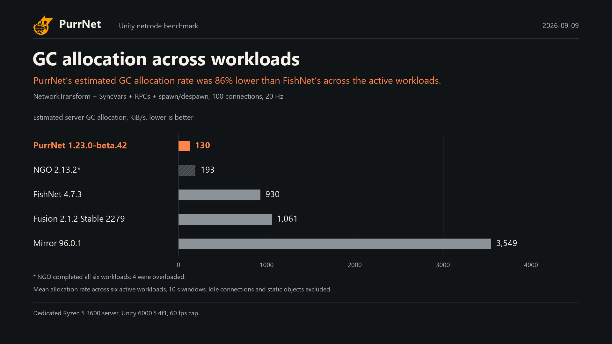

# PurrNet promotional benchmark charts

1 chart, with 1920 × 1080 PNG and matching SVG exports, based on the **2026-09-09** published run.

[PurrNet 1.23.0-beta.42 · FishNet 4.7.3 · Mirror 96.0.1 · NGO 2.13.2 · Fusion 2.1.2 Stable 2279](https://github.com/PurrNet/unity-netcode-benchmark/actions/runs/34364138644)

These are selected resource comparisons, not an overall netcode ranking. All five netcodes are shown on linear scales starting at zero. Overloaded rows remain visible and are marked. Percent reductions use unrounded raw values, rounded to the nearest whole percent.

## GC allocation across workloads

GC allocation across workloads. PurrNet’s estimated GC allocation rate was 86% lower than FishNet’s across the active workloads. NetworkTransform + SyncVars + RPCs + spawn/despawn, 100 connections, 20 Hz.



[PNG](03-general-gc.png) · [SVG](03-general-gc.svg)

Arithmetic mean of server gcAllocBytesPerSec across MoveY, MoveWander, SyncVars, SendRPC, ClientInput and SpawnChurn at 100 connections and 20 Hz. 10 s windows; Idle and Static excluded. 1 KiB = 1,024 bytes.

Allocation is estimated from positive managed-heap growth between frames, not a precise allocation count. NGO includes overloaded workloads and is not eligible for a best-value claim. One run; no repeat variability measured.

## Provenance and calculation

- [Source workflow run](https://github.com/PurrNet/unity-netcode-benchmark/actions/runs/34364138644)
- [Full methodology and live report](https://purrnet.github.io/unity-netcode-benchmark/)
- [Raw source at the pulled revision](https://github.com/PurrNet/unity-netcode-benchmark/blob/8a50dd332178e9ed70b9215721cbb2543a920363/docs/latest.json)
- Source JSON SHA-256: `13d99fafb30f9109e8eff58f9463e0c6df49e66dfda8749058422cc0ce1bc373`
- [Exact plotted values and claims](chart-data.json)
- [Supplied PurrNet logo](../assets/purrnet-logo-orange.png), embedded in every PNG and SVG header.
- Reduction formula: `100 × (1 − PurrNet / named competitor)`.
- Measurements use the existing report’s arithmetic means and completion/overload rules.
- General GC averages allocation rates across six active workloads (MoveY, MoveWander, SyncVars, SendRPC, ClientInput and SpawnChurn) at 100 connections and 20 Hz; Idle and Static are excluded.
- Rows marked with an asterisk include overload. This can make resource use lower than equivalent unsaturated service; they are not eligible for best-value claims.
- Allocation is a heap-growth estimate, not the profiler allocation counter or process memory usage.
- Individual versions, transport differences, replication behavior, and benchmark overrides are documented in the full methodology.

## Regenerate

Install `matplotlib` and `pillow`, then run from the repository root:

```sh
python .github/scripts/render-promo.py --chart 03-general-gc
```

This reads `docs/latest.json` and the run metadata in `docs/latest.md`, and writes a dated folder under `docs/promo/`. To reproduce an older run, pass its matching `--data` and `--summary` files, plus `--source-revision` and `--output`. The renderer stops when required data are missing or the highlighted result is overloaded.
