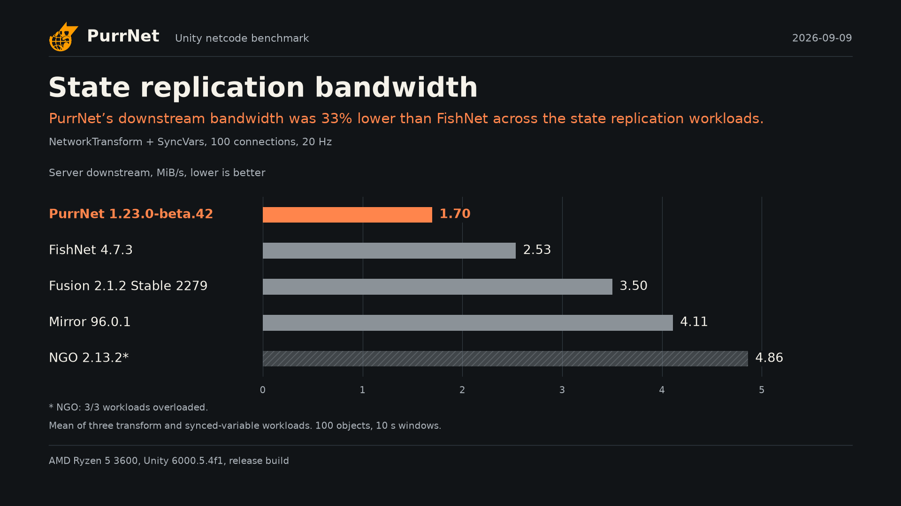
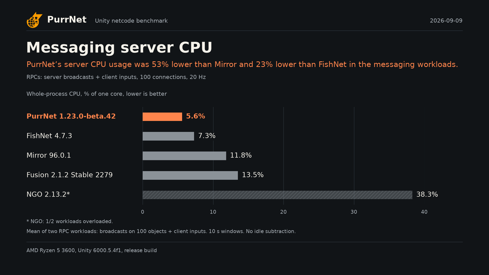
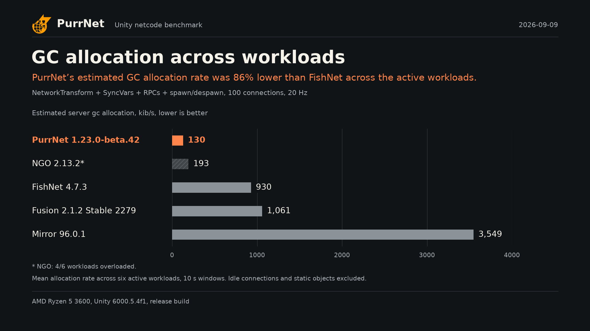
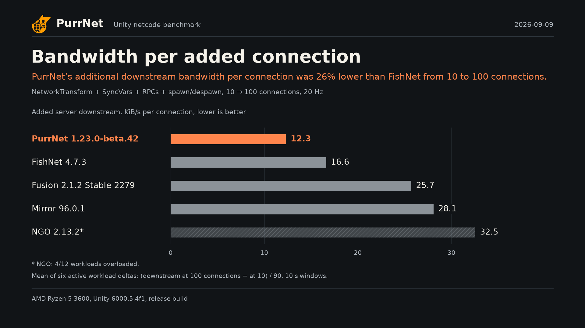

# PurrNet promotional benchmark charts

4 charts, with 1920 × 1080 PNG and matching SVG exports, from **2026-09-09**.

[PurrNet 1.23.0-beta.42 · FishNet 4.7.3 · Mirror 96.0.1 · NGO 2.13.2 · Fusion 2.1.2 Stable 2279](https://github.com/PurrNet/unity-netcode-benchmark/actions/runs/34364138644)

These are selected resource comparisons, not an overall netcode ranking. Each chart includes all five netcodes on a linear scale starting at zero. Asterisks and hatching mark overload. Relative percentages use unrounded values and round to the nearest whole percent.

## State replication bandwidth

State replication bandwidth. PurrNet’s downstream bandwidth was 33% lower than FishNet across the state replication workloads. NetworkTransform + SyncVars, 100 connections, 20 Hz.



[PNG](01-state-bandwidth.png) / [SVG](01-state-bandwidth.svg)

Arithmetic mean of server txBytesPerSec. Tests: MoveY, MoveWander, SyncVars. Sessions: 100 connections, 20 Hz. 10 s windows. No idle subtraction. Binary byte units (1 KiB = 1,024 bytes).

One published run. Overloaded rows describe saturated servers and are not used for comparative claims.

## Messaging server CPU

Messaging server CPU. PurrNet’s server CPU usage was 53% lower than Mirror and 23% lower than FishNet in the messaging workloads. RPCs: server broadcasts + client inputs, 100 connections, 20 Hz.



[PNG](02-messaging-cpu.png) / [SVG](02-messaging-cpu.svg)

Arithmetic mean of server cpuPercent. Tests: SendRPC, ClientInput. Sessions: 100 connections, 20 Hz. 10 s windows. No idle subtraction. Binary byte units (1 KiB = 1,024 bytes).

One published run. Overloaded rows describe saturated servers and are not used for comparative claims.

## GC allocation across workloads

GC allocation across workloads. PurrNet’s estimated GC allocation rate was 86% lower than FishNet across the active workloads. NetworkTransform + SyncVars + RPCs + spawn/despawn, 100 connections, 20 Hz.



[PNG](03-general-gc.png) / [SVG](03-general-gc.svg)

Arithmetic mean of server gcAllocBytesPerSec. Tests: MoveY, MoveWander, SyncVars, SendRPC, ClientInput, SpawnChurn. Sessions: 100 connections, 20 Hz. 10 s windows. No idle subtraction. Binary byte units (1 KiB = 1,024 bytes).

One published run. Overloaded rows describe saturated servers and are not used for comparative claims. Allocation is estimated from frame-to-frame managed-heap growth, using a running average when collection shrinks the heap.

## Bandwidth per added connection

Bandwidth per added connection. PurrNet’s additional downstream bandwidth per connection was 26% lower than FishNet from 10 to 100 connections. NetworkTransform + SyncVars + RPCs + spawn/despawn, 10 → 100 connections, 20 Hz.



[PNG](04-connection-scaling.png) / [SVG](04-connection-scaling.svg)

Mean of per-test (100-connection − 10-connection) server downstream / 90. Tests: MoveY, MoveWander, SyncVars, SendRPC, ClientInput, SpawnChurn. Sessions: 10 → 100 connections, 20 Hz. 10 s windows. No idle subtraction. Binary byte units (1 KiB = 1,024 bytes).

One published run. Overloaded rows describe saturated servers and are not used for comparative claims.

## Source and calculation

- [Workflow run](https://github.com/PurrNet/unity-netcode-benchmark/actions/runs/34364138644)
- [Exact raw data used for these images](source-data.json)
- [Run metadata and original summary](source-summary.md)
- [Plotted values, claims and skipped charts](chart-data.json)
- Raw data SHA-256: `13d99fafb30f9109e8eff58f9463e0c6df49e66dfda8749058422cc0ce1bc373`
- Renderer checkout revision: `8a50dd332178e9ed70b9215721cbb2543a920363`. This identifies the code checkout, not the data snapshot.
- Lower/higher comparisons use `100 × (PurrNet / named competitor − 1)`. Zero baselines and overloaded comparators receive neutral text.
- Bandwidth and CPU categories use arithmetic means. General GC uses the six active workloads. Scaling averages their per-test `(100 connections − 10 connections) / 90` bandwidth deltas.
- Idle and Static are excluded. Missing or incomplete workloads are not treated as zero.
- GC labels distinguish heap-growth estimates from profiler counters. A mixture of those methods makes the GC chart unavailable.
- Source, units and full workload names are retained in the bundled data; the images use short workload descriptions.

## Regenerate

Install the pinned dependencies with `python -m pip install -r .github/scripts/requirements-promo.txt`, then run from the repository root:

```sh
python .github/scripts/render-promo.py --ci --output docs/promo/latest
```

Use `--chart 03-general-gc` to select one chart. To reproduce this particular bundle, supply its `source-data.json` with `--data` and `source-summary.md` with `--summary`. A render replaces the generated chart bundle in its output directory, including removing skipped or unselected images.

`--ci` skips unsupported comparisons with reasons in this README and `chart-data.json`; unexpected errors still fail the job. Without `--ci`, an unavailable comparison raises an error.
